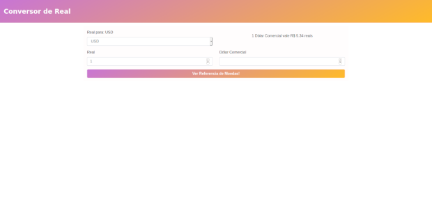
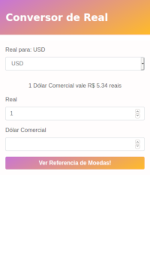

# Conversor de Moedas para Real!

Este repositório é baseado no projeto Criando projeto para consultar a previsão do tempo via API do professor João Victor Ghignatti, do BootCamp da Avanade.
	
Fiz uma aplicação para converter moedas para real, ela pega uma lista de moedas de uma api online que vai servir de base para aplicação

## O que usei na aplicação

 - Angular
 - Bootsrtap 4
 - @ngrx/store
 - @ngrx/effects
 - Api: https://economia.awesomeapi.com.br/json/all

